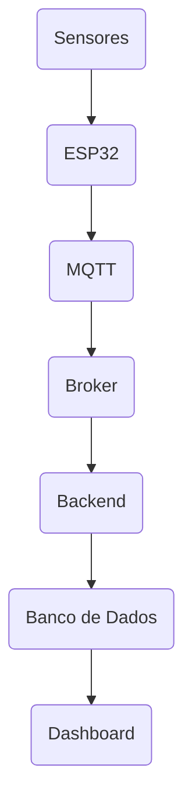
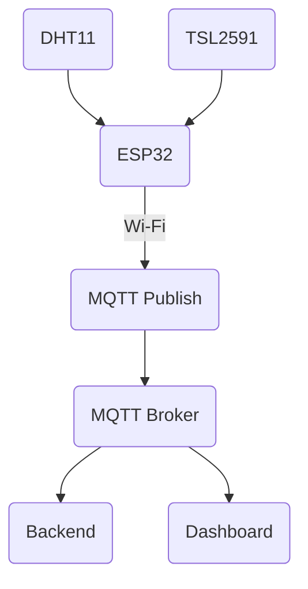

# Estação Ambiental IoT

Sistema embarcado para monitoramento ambiental desenvolvido com um microcontrolador e sensores de baixo custo. O desenvolvimento do protótipo empregou conceitos utilizados na construção de um projeto *Internet of Things* (IoT):

* sensores ambientais
* microcontroladores
* conectividade Wi-Fi
* protocolo MQTT
  * publish
  * subscribe
* processamento e visualização de dados



## Arquitetura do sistema

Sistema embarcado para monitoramento ambiental com **ESP32** e sensores **DHT11** e **TSL2591**. Para a comunicação entre as camadas, foi utilizado o Wi-Fi com o protocolo **MQTT**.



## Variáveis capturadas pelos sensores

À principio, foram selecionados dois sensores que permitem a leitura de alguns atributos básicos de um ambiente:

* **DHT11**
  * temperatura
  * umidade
* **TSL2591**
  * luminosidade

## Estrutura da mensagem MQTT

**Topic**:

```text
iot/esp32/environment
```

**Payload**:

```json
{
    "device_id":"esp32_01",
    "temperature":25.3,
    "humidity":81,
    "lux":15.14756
}
```

## Ligações dos sensores

### DHT11

| DHT11 | ESP32  |
|-------|--------|
| VCC   | 3.3V   |
| GND   | GND    |
| DATA  | GPIO 4 |

---

### TSL2591

| TSL2591 | ESP32   |
|---------|---------|
| VIN     | 3.3V    |
| GND     | GND     |
| SDA     | GPIO 21 |
| SCL     | GPIO 22 |

## Dependências

Para o funcionamento do código, instalar as seguintes bibliotecas no *Arduino Library Manager*:

* PubSubClient
* DHT sensor library (Adafruit)
* Adafruit TSL2591 Library
* ArduinoJson
